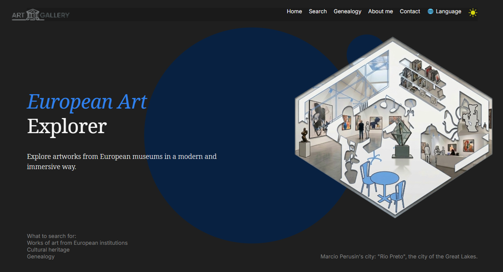
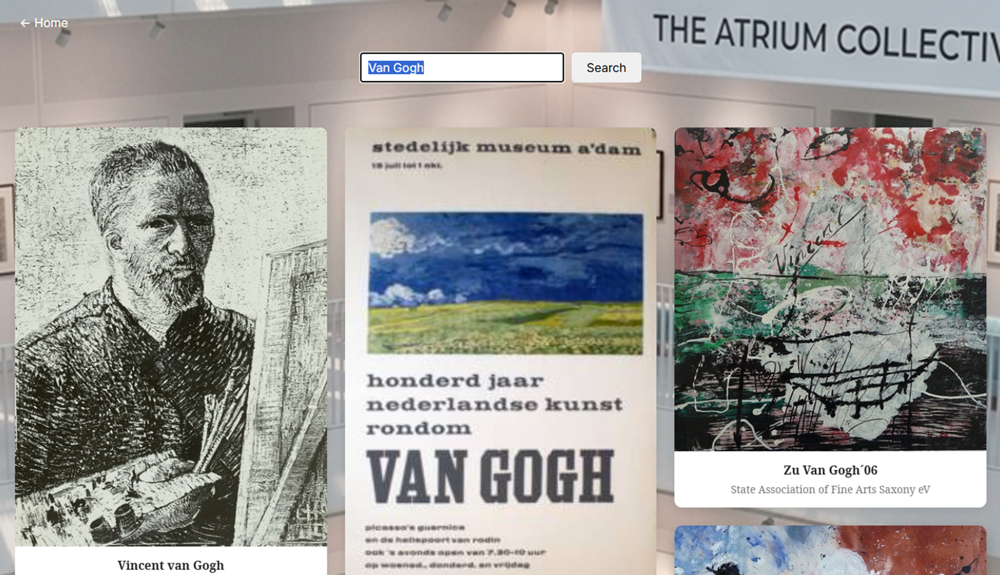
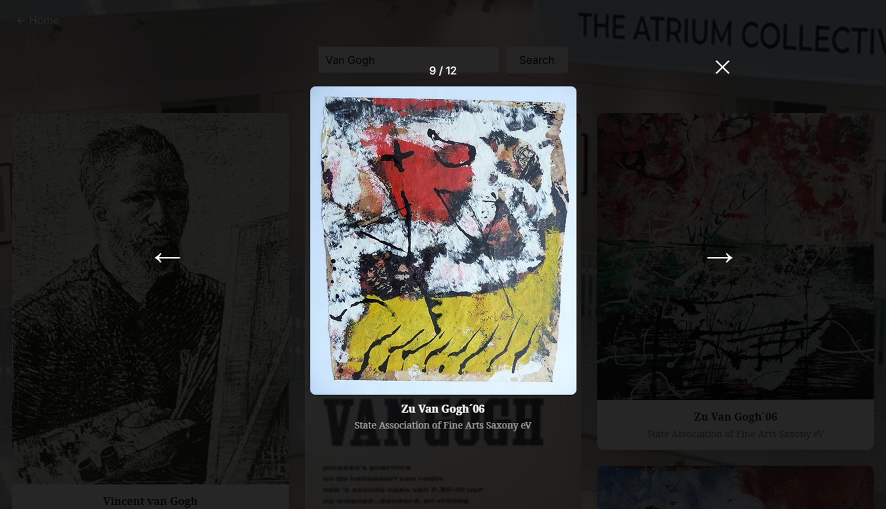
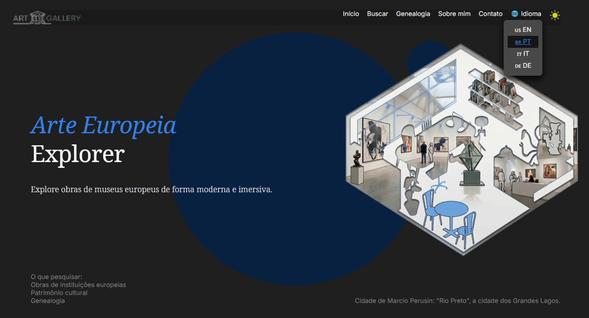
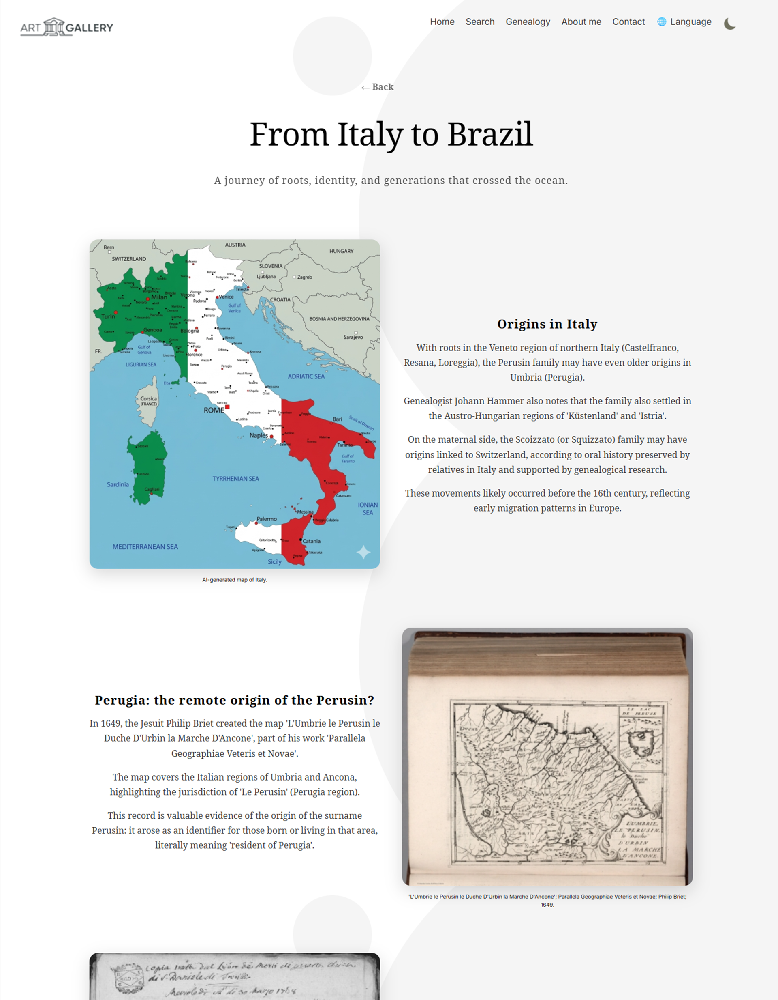
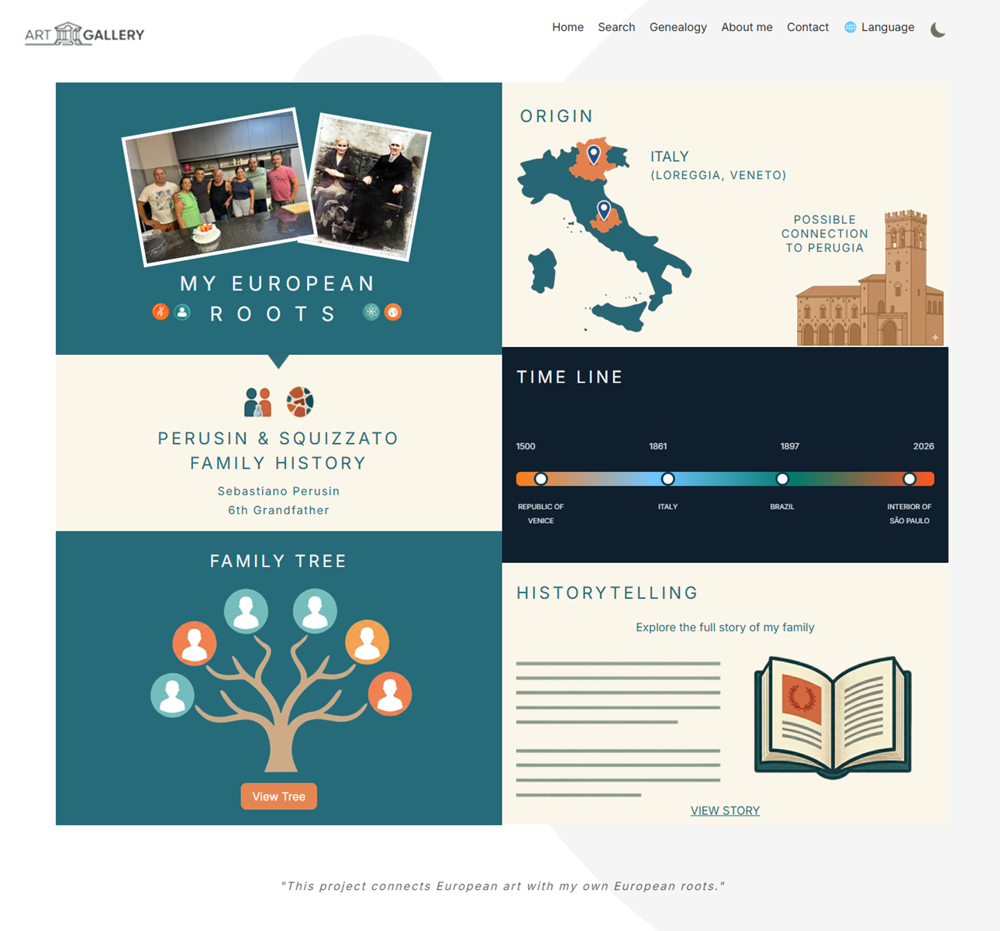
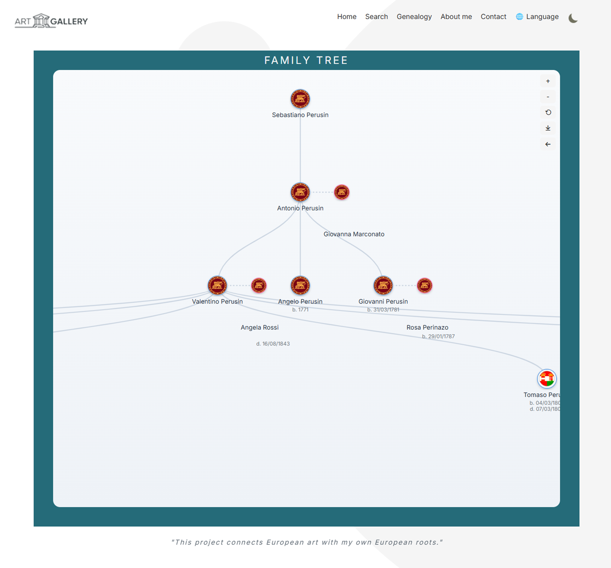
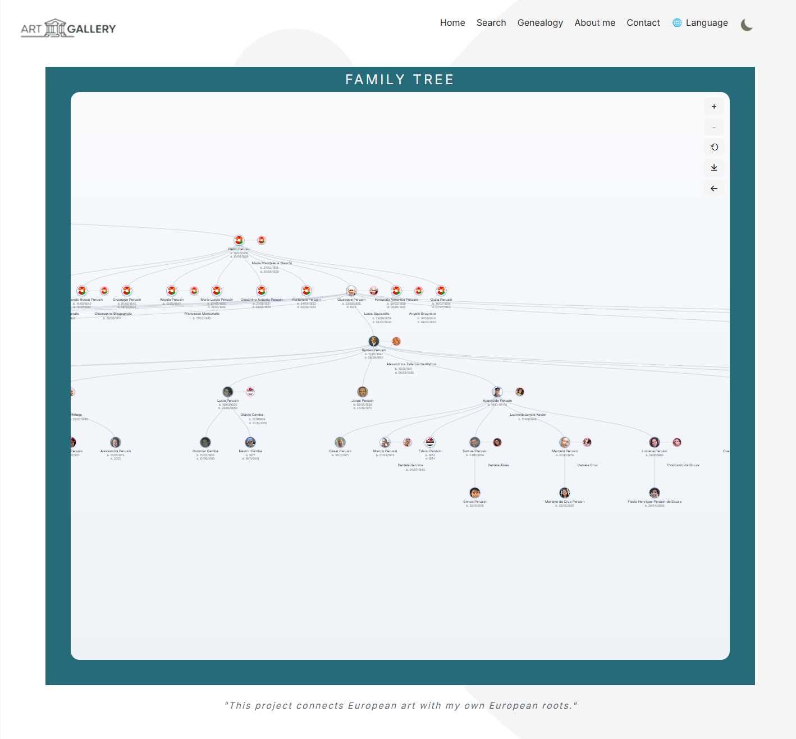

# 🎨 Art Gallery Explorer

<p align="center">
  
  
  
  
  
  
</p>

<p align="center">
  [](https://europeana-art-gallery.vercel.app/)
</p>

> 🎯 Interactive multilingual cultural exploration platform built with React, Vite, D3.js, and the Europeana API.

<p align="center">
  🇧🇷 <a href="#-português">Português</a> |
  🇺🇸 <a href="#-english">English</a> |
  🇮🇹 <a href="#-italiano">Italiano</a> |
  🇩🇪 <a href="#-deutsch">Deutsch</a>
</p>

---

## 🚀 Live Application

🌐 [Open Art Gallery Explorer](https://europeana-art-gallery.vercel.app/)

---

# 📑 Table of Contents

* 🇧🇷 [Português](#-português)

  * [Visão Geral](#-visão-geral)
  * [Arquitetura do Projeto](#️-arquitetura-do-projeto)
  * [Demonstração em Vídeo](#-demonstração-em-vídeo)
  * [Demonstração Visual](#-demonstração-visual)
  * [Funcionalidades](#-funcionalidades-2)
  * [Tecnologias Utilizadas](#️-tecnologias-utilizadas)
  * [Integração com APIs](#-integração-com-apis)
  * [Internacionalização](#-internacionalização)
  * [Visualização Genealógica](#-visualização-genealógica)
  * [Estrutura do Projeto](#-estrutura-do-projeto)
  * [Como Executar Localmente](#-como-executar-localmente)
  * [Roadmap Futuro](#-roadmap-futuro)
  * [Autor](#-autor-1)

* 🇺🇸 [English](#-english)

  * [Overview](#-overview)
  * [Project Architecture](#-project-architecture)
  * [Video Demonstration](#-video-demonstration)
  * [Visual Demonstration](#-visual-demonstration)
  * [Features](#-features)
  * [Technologies Used](#️-technologies-used)
  * [API Integration](#-api-integration)
  * [Internationalization](#-internationalization)
  * [Genealogy Visualization](#-genealogy-visualization)
  * [Project Structure](#-project-structure)
  * [Running Locally](#-running-locally)
  * [Future Roadmap](#-future-roadmap)
  * [Author](#-author-1)

* 🇮🇹 [Italiano](#-italiano)

* 🇩🇪 [Deutsch](#-deutsch)

---

<a id="-português"></a>

# 🇧🇷 Português

## 🎨 Visão Geral

O **Art Gallery Explorer** é uma aplicação React moderna e multilíngue desenvolvida como projeto final Full Stack da TripleTen.

A aplicação integra a API pública da Europeana para permitir a exploração de obras de arte, coleções históricas e conteúdos culturais europeus através de uma interface moderna, responsiva e interativa.

Além da experiência de galeria digital, o projeto também inclui:

* Sistema multilíngue
* Storytelling genealógico
* Visualização de árvore familiar com D3.js
* Sistema de favoritos
* Navegação dinâmica
* Lazy loading
* Estrutura escalável para futura integração backend

⬆ [Voltar ao topo](#-table-of-contents)

---

## 🏗️ Arquitetura do Projeto

```txt
React + Vite Frontend
          ↓
Europeana REST API
          ↓
Local Storage Layer
          ↓
D3.js Visualization Engine
```

O projeto foi estruturado utilizando arquitetura baseada em componentes reutilizáveis, separando responsabilidades entre:

* Pages
* Components
* Utilities
* Contexts
* Translation files
* Local storage services
* Genealogy data

⬆ [Voltar ao topo](#-table-of-contents)

---

## 🎥 Demonstração em Vídeo

### 🎬 Video 1 — Visão Geral + Arquitetura

[▶️ Assistir ao Vídeo 1](https://www.loom.com/share/7f33bf24bdcd4edfa4e59e9911dd852b)

Este vídeo apresenta:

* Visão geral do projeto
* Arquitetura React + Vite
* Integração com a API da Europeana
* Sistema de internacionalização
* Estrutura do projeto
* Design responsivo

---

### 🎬 Video 2 — Recursos + Experiência do Usuário

[▶️ Assista ao Vídeo 2](https://www.loom.com/share/1a935f1059a8477bb37829d9ee13674b)

Este vídeo demonstra:

* Experiência de busca
* Filtros
* Páginas de detalhes da obra de arte
* Carregamento lento (lazy loading)
* Suporte multilíngue
* Navegação e acessibilidade

---

### 🎬 Video 3 — Genealogia + História + D3

[▶️ Assista ao Vídeo 3](https://www.loom.com/share/d6219fbebce34402b2e4c0fabc17d403)

Este vídeo demonstra:

* Narrativa genealógica
* Visualização interativa de árvores genealógicas
* Renderização com D3.js
* Layouts dinâmicos
* Galerias de imagens históricas
* Exploração cultural

⬆ [Voltar ao topo](#-table-of-contents)

---

## 📸 Demonstração Visual

### 🌍 Interface Hero


---

### 🔎 Experiência de Pesquisa



---

### 🎨 Página de detalhes da obra de arte



---

### 🌍 Sistema multilíngue



---

### 🌳 Narrativa Genealógica



---

### 🌳 Página de Genealogia



---

### 🌳 Visualização de Árvore D3 — Zoom



---

### 🌳 Visualização de árvore D3 — Panorâmica



⬆ [Voltar ao topo](#-table-of-contents)

---

## ✨ Funcionalidades

### 🖼️ Exploração de Obras

* Busca dinâmica de obras via Europeana API
* Navegação por coleções
* Exibição de imagens e metadados
* Visualização detalhada das obras
* Carregamento progressivo (lazy loading)

### 🌍 Internacionalização

* Português
* Inglês
* Italiano
* Alemão

### 🚀 Estrutura Preparada para Expansão

* Arquitetura preparada para futuras funcionalidades
* Possível integração futura de sistema de favoritos
* Estrutura compatível com persistência local e backend

### 🌳 Genealogia e Storytelling

* Story pages históricas
* Narrativas familiares
* Visualização D3.js
* Estrutura dinâmica de árvore genealógica
* Galerias históricas

### 📱 Responsividade

* Desktop
* Tablet
* Mobile

⬆ [Voltar ao topo](#-table-of-contents)

---

## 🛠️ Tecnologias Utilizadas

### Frontend

* React 19
* Vite
* React Router DOM
* Framer Motion
* D3.js
* CSS3
* JavaScript ES6+

### Internacionalização

* i18next
* react-i18next

### Persistência Local

* localForage
* Local Storage API

### Visualização

* D3.js
* SVG rendering
* Interactive tree visualization

⬆ [Voltar ao topo](#-table-of-contents)

---

## 🔌 Integração com APIs

### 🌍 Europeana API

A aplicação utiliza a API pública da Europeana para obter obras de arte, coleções digitais e metadados históricos.

🔗 [https://pro.europeana.eu/discover-the-data/apis](https://pro.europeana.eu/discover-the-data/apis)

A camada de integração está organizada em:

```txt
src/utils/europeanaApi.js
```

### 💾 Camada Local de Dados

O projeto também utiliza armazenamento local através de:

```txt
src/utils/storage.js
```

Essa estrutura foi projetada para permitir futura migração para:

* Backend Node.js
* Banco de dados remoto
* APIs próprias
* Sistema de autenticação

⬆ [Voltar ao topo](#-table-of-contents)

---

## 🌍 Internacionalização

A aplicação foi desenvolvida com suporte multilíngue completo utilizando i18next.

Idiomas atualmente disponíveis:

* 🇧🇷 Português
* 🇺🇸 English
* 🇮🇹 Italiano
* 🇩🇪 Deutsch

O sistema traduz:

* Navegação
* Menus
* Botões
* Story pages
* Genealogy pages
* Mensagens dinâmicas
* Conteúdo estrutural

⬆ [Voltar ao topo](#-table-of-contents)

---

## 🌳 Visualização Genealógica

Um dos diferenciais do projeto é o sistema de genealogia interativa.

A aplicação inclui:

* Storytelling histórico
* Árvores genealógicas interativas
* Navegação visual dinâmica
* Zoom e pan em visualizações D3.js
* Galerias históricas familiares

A estrutura foi desenvolvida para permitir futura expansão para:

* Dados remotos
* APIs genealógicas
* Colaboração multiusuário
* IA aplicada à genealogia

⬆ [Voltar ao topo](#-table-of-contents)

---

## 📁 Estrutura do Projeto

```txt
src/
 ├── components/
 ├── pages/
 ├── contexts/
 ├── hooks/
 ├── data/
 ├── utils/
 ├── locales/
 ├── assets/
 └── styles/
```

⬆ [Voltar ao topo](#-table-of-contents)

---

## 💻 Como Executar Localmente

### Instalação

```bash
npm install
```

### Ambiente de Desenvolvimento

```bash
npm run dev
```

### Build de Produção

```bash
npm run build
```

### Preview de Produção

```bash
npm run preview
```

⬆ [Voltar ao topo](#-table-of-contents)

---

## 🚀 Roadmap Futuro

### Backend

* Node.js + Express
* MongoDB
* APIs próprias
* Sistema de usuários
* Autenticação JWT

### Inteligência Artificial

* Integração OpenAI
* Busca semântica
* Assistente cultural
* Geração de narrativas históricas

### Genealogia

* Banco de dados remoto
* Timeline histórica
* Compartilhamento colaborativo
* Upload de documentos históricos

⬆ [Voltar ao topo](#-table-of-contents)

---

## 👨‍💻 Autor

**Marcio Perusin**

Desenvolvedor Full Stack

🔗 GitHub: [https://github.com/Perozin](https://github.com/Perozin)

🔗 LinkedIn: [https://www.linkedin.com/in/marcio-p-58162334](https://www.linkedin.com/in/marcio-p-58162334)

⬆ [Voltar ao topo](#-table-of-contents)

---

---

<a id="-english"></a>

# 🇺🇸 English

## 🎨 Overview

Art Gallery Explorer is a modern multilingual React application developed as a final Full Stack project for TripleTen.

The application integrates the Europeana public API to provide access to artworks, historical collections, and cultural heritage content through a modern, responsive, and interactive interface.

In addition to the digital gallery experience, the project also includes:

* Multilingual support
* Genealogy storytelling
* D3.js family tree visualization
* Dynamic navigation
* Lazy loading
* Scalable architecture for future backend integration

⬆ [Back to top](#-table-of-contents)

---

## 🏗️ Project Architecture

```txt
React + Vite Frontend
          ↓
Europeana REST API
          ↓
Local Storage Layer
          ↓
D3.js Visualization Engine
```

The project follows a component-based architecture with clear separation of responsibilities between:

* Pages
* Components
* Utilities
* Contexts
* Translation files
* Local storage services
* Genealogy data

⬆ [Back to top](#-table-of-contents)

---

## 🎥 Video Demonstration

### 🎬 Video 1 — Overview + Architecture

[▶️ Watch Video 1](https://www.loom.com/share/7f33bf24bdcd4edfa4e59e9911dd852b)

This video presents:

* Project overview
* React + Vite architecture
* Europeana API integration
* Internationalization system
* Project structure
* Responsive design

---

### 🎬 Video 2 — Features + User Experience

[▶️ Watch Video 2](https://www.loom.com/share/1a935f1059a8477bb37829d9ee13674b)

This video demonstrates:

* Search experience
* Filters
* Artwork details pages
* Lazy loading
* Multilingual support
* Navigation and accessibility

---

### 🎬 Video 3 — Genealogy + Story + D3

[▶️ Watch Video 3](https://www.loom.com/share/d6219fbebce34402b2e4c0fabc17d403)

This video demonstrates:

* Genealogy storytelling
* Interactive family tree visualization
* D3.js rendering
* Dynamic layouts
* Historical image galleries
* Cultural exploration

⬆ [Back to top](#-table-of-contents)

---

## 📸 Visual Demonstration

### 🌍 Hero Interface


---

### 🔎 Search Experience


---

### 🎨 Artwork Details Page


---

### 🌍 Multilingual System


---

### 🌳 Genealogy Storytelling


---

### 🌳 Genealogy Page


---

### 🌳 D3 Tree Visualization — Zoom


---

### 🌳 D3 Tree Visualization — Pan


⬆ [Back to top](#-table-of-contents)

---

## ✨ Features

### 🖼️ Artwork Exploration

* Dynamic artwork search using the Europeana API
* Collection browsing
* Artwork metadata visualization
* Detailed artwork pages
* Progressive loading (lazy loading)

### 🌍 Internationalization

* Portuguese
* English
* Italian
* German

### 🚀 Expansion-Ready Architecture

* Architecture prepared for future feature expansion
* Possible future favorites system integration
* Structure compatible with local persistence and backend evolution

### 🌳 Genealogy and Storytelling

* Historical story pages
* Family narratives
* D3.js visualization
* Dynamic genealogy trees
* Historical galleries

### 📱 Responsive Design

* Desktop
* Tablet
* Mobile

⬆ [Back to top](#-table-of-contents)

---

## 🛠️ Technologies Used

### Frontend

* React 19
* Vite
* React Router DOM
* Framer Motion
* D3.js
* CSS3
* JavaScript ES6+

### Internationalization

* i18next
* react-i18next

### Local Persistence

* localForage
* Local Storage API

### Visualization

* D3.js
* SVG rendering
* Interactive tree visualization

⬆ [Back to top](#-table-of-contents)

---

## 🔌 API Integration

### 🌍 Europeana API

The application integrates the Europeana public API to retrieve artworks, digital collections, and historical metadata.

🔗 [https://pro.europeana.eu/discover-the-data/apis](https://pro.europeana.eu/discover-the-data/apis)

The integration layer is organized in:

```txt
src/utils/europeanaApi.js
```

### 💾 Local Data Layer

The project also uses local persistence through:

```txt
src/utils/storage.js
```

This structure was designed to support future migration to:

* Node.js backend
* Remote databases
* Custom APIs
* Authentication systems

⬆ [Back to top](#-table-of-contents)

---

## 🌍 Internationalization

The application was developed with full multilingual support using i18next.

Currently supported languages:

* 🇧🇷 Portuguese
* 🇺🇸 English
* 🇮🇹 Italian
* 🇩🇪 German

The translation system covers:

* Navigation
* Menus
* Buttons
* Story pages
* Genealogy pages
* Dynamic messages
* Structural content

⬆ [Back to top](#-table-of-contents)

---

## 🌳 Genealogy Visualization

One of the project's main highlights is the interactive genealogy system.

The application includes:

* Historical storytelling
* Interactive family trees
* Dynamic visual navigation
* Zoom and pan with D3.js
* Historical family galleries

The architecture was designed for future expansion including:

* Remote data integration
* Genealogy APIs
* Multi-user collaboration
* AI-assisted genealogy features

⬆ [Back to top](#-table-of-contents)

---

## 📁 Project Structure

```txt
src/
 ├── components/
 ├── pages/
 ├── contexts/
 ├── hooks/
 ├── data/
 ├── utils/
 ├── locales/
 ├── assets/
 └── styles/
```

⬆ [Back to top](#-table-of-contents)

---

## 💻 Running Locally

### Installation

```bash
npm install
```

### Development Environment

```bash
npm run dev
```

### Production Build

```bash
npm run build
```

### Production Preview

```bash
npm run preview
```

⬆ [Back to top](#-table-of-contents)

---

## 🚀 Future Roadmap

### Backend

* Node.js + Express
* MongoDB
* Custom APIs
* User accounts
* JWT authentication

### Artificial Intelligence

* OpenAI integration
* Semantic search
* Cultural assistant
* Historical narrative generation

### Genealogy

* Remote database
* Historical timelines
* Collaborative sharing
* Historical document uploads

⬆ [Back to top](#-table-of-contents)

---

## 👨‍💻 Author

**Marcio Perusin**

Full Stack Developer

🔗 GitHub: [https://github.com/Perozin](https://github.com/Perozin)

🔗 LinkedIn: [https://www.linkedin.com/in/marcio-p-58162334](https://www.linkedin.com/in/marcio-p-58162334)

⬆ [Back to top](#-table-of-contents)

---

---

<a id="-italiano"></a>

# 🇮🇹 Italiano

## 🎨 Panoramica

Art Gallery Explorer è un'applicazione React moderna e multilingue sviluppata come progetto finale Full Stack per TripleTen.

L'applicazione integra l'API pubblica di Europeana per consentire l'esplorazione di opere d'arte, collezioni storiche e contenuti culturali europei attraverso un'interfaccia moderna, responsiva e interattiva.

### Caratteristiche principali

* Supporto multilingue
* Storytelling genealogico
* Visualizzazione D3.js
* Design responsivo
* Architettura scalabile

⬆ [Torna all'inizio](#-table-of-contents)

---

## 👨‍💻 Autore

**Marcio Perusin**

🔗 GitHub: [https://github.com/Perozin](https://github.com/Perozin)

🔗 LinkedIn: [https://www.linkedin.com/in/marcio-p-58162334](https://www.linkedin.com/in/marcio-p-58162334)

---

---

<a id="-deutsch"></a>

# 🇩🇪 Deutsch

## 🎨 Übersicht

Art Gallery Explorer ist eine moderne mehrsprachige React-Anwendung, die als Abschlussprojekt für TripleTen entwickelt wurde.

Die Anwendung integriert die öffentliche Europeana-API, um Kunstwerke, historische Sammlungen und kulturelle Inhalte über eine moderne, responsive und interaktive Benutzeroberfläche zugänglich zu machen.

### Hauptfunktionen

* Mehrsprachiges System
* Genealogisches Storytelling
* D3.js-Visualisierung
* Responsives Design
* Skalierbare Architektur

⬆ [Zurück nach oben](#-table-of-contents)

---

## 👨‍💻 Autor

**Marcio Perusin**

🔗 GitHub: [https://github.com/Perozin](https://github.com/Perozin)

🔗 LinkedIn: [https://www.linkedin.com/in/marcio-p-58162334](https://www.linkedin.com/in/marcio-p-58162334)
